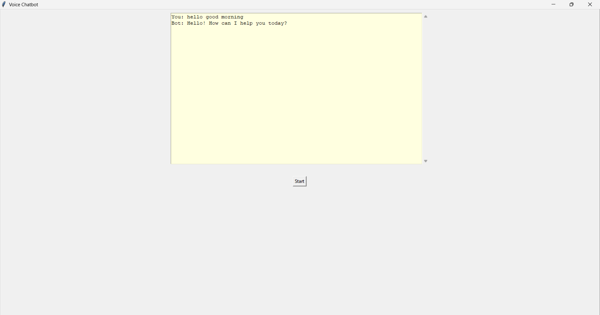

# Voice_ChatBot
The Voice Chatbot is an interactive application that combines voice recognition and text-to-speech technologies to create a conversational experience. This chatbot listens to the user's spoken input, processes the input to determine an appropriate response, and then responds in both text and spoken formats.

Built using Python, the application leverages libraries like speech_recognition for capturing and interpreting speech, pyttsx3 for generating voice responses, and tkinter for creating a user-friendly graphical interface. It provides a seamless way to interact with users through voice, making it ideal for applications like customer support, virtual assistants, or accessibility tools for users who prefer or require voice-based interaction.

The project demonstrates the integration of multiple technologies to create an engaging and dynamic user experience, showcasing how voice-based applications can be developed for various real-world scenarios.

# Features

- **Voice Recognition**: Listens to and recognizes user speech.
- **Text-to-Speech**: Converts text responses into spoken words.
- **Graphical Interface**: Easy-to-use interface built with `tkinter`.

## Technologies Used

- **Python**: Core programming language.
- **tkinter**: Python library for creating the GUI.
- **speech_recognition**: Python library for speech recognition.
- **pyttsx3**: Python library for text-to-speech conversion.

## Installation

**Clone the repository:**

   `git clone https://github.com/Hanzala13/voice_ChatBot.git`
   `cd voice-chatbot`

**Install the required dependencies:**

`pip install speechrecognition pyttsx3 pyaudio`

Note: On some systems, installing pyaudio might require additional setup. Refer to the PyAudio documentation for more details.

**Usage**
Run the script:

`python voice_chatbot.py`
Click the "Start" button in the application window.

Speak into your microphone. The chatbot will listen to your input, process it, and provide a spoken response.

## Code Overview
1. Text-to-Speech Initialization
The application initializes a text-to-speech engine using pyttsx3:

python
Copy code
engine = pyttsx3.init()

2. Function Definitions
speak_text(text): Converts the provided text into speech.
recognize_speech(): Captures user voice input using a microphone and converts it to text.
process_response(text): Generates a simple response based on the user's input.

4. GUI Setup
The GUI is created using tkinter, with elements like the main window, chat frame, text box for conversation display, and a start button.

5. Running the Application
The application runs an event loop to keep the GUI active:

python
Copy code
app.mainloop()
Future Improvements
Add more complex response logic and integrate with external APIs for enhanced functionality.
Improve error handling and user feedback for speech recognition.
Add more interactive GUI elements for better user experience.

## Contributing
Feel free to fork this repository, make changes, and submit pull requests. Contributions are welcome!

## License
This project is licensed under the MIT License. See the LICENSE file for details.

## Contact
If you have any questions or suggestions, please feel free to contact me at hanzalaansari674@gmail.com.

